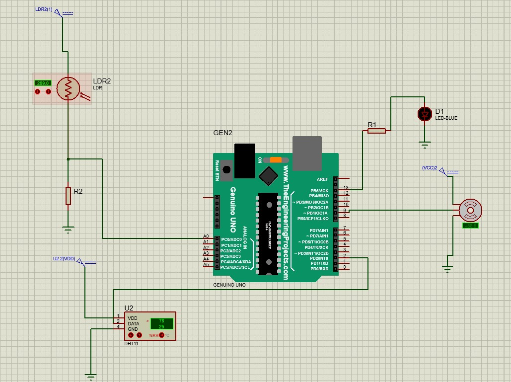
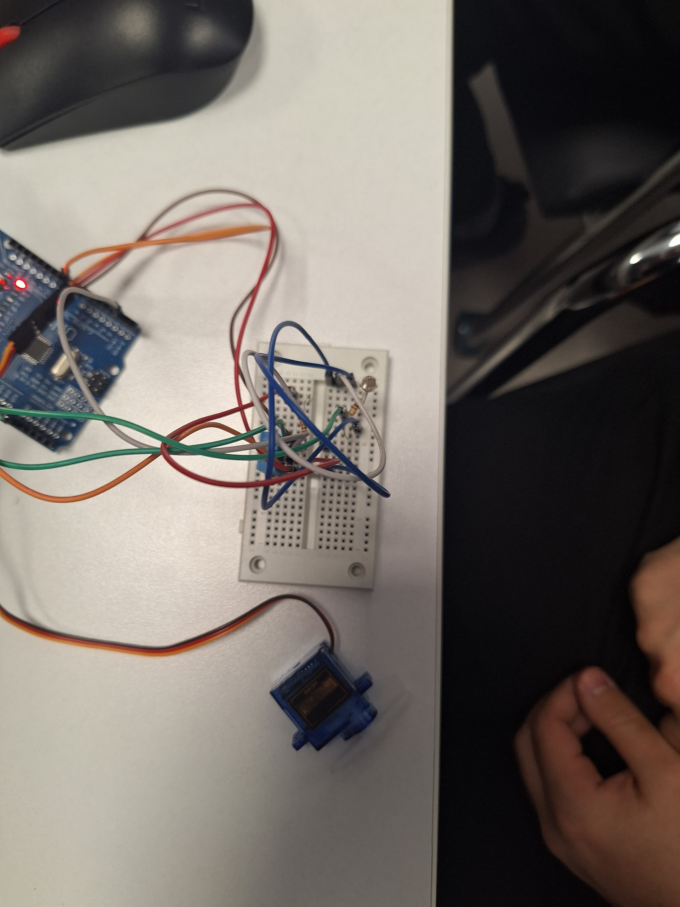
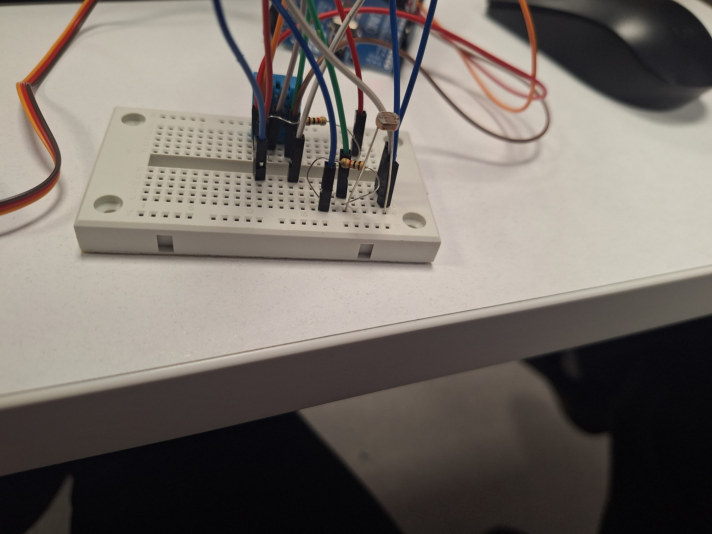
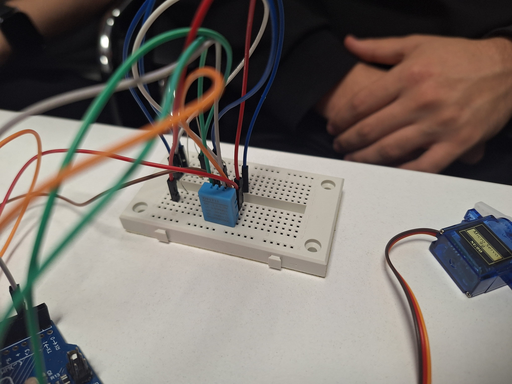
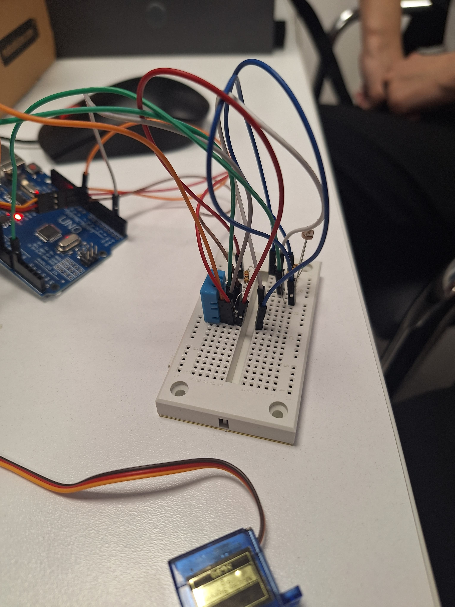

# Ara Rapor

## 1. Proje Konusu
Işık ve sıcaklık seviyelerine bağlı olarak çalışan, perdeyi otomatik olarak açıp kapatabilen bir akıllı kontrol sistemi.

## 2. Özet
Bu proje kapsamında, iç ortamda sıcaklık ve ışık sensörleri kullanılarak, bir servo motor ile perde kontrolü sağlanmaktadır. Bu sayede güneş ışığına ve sıcaklığa bağlı olarak perdelerin otomatik açılıp kapanması hedeflenmektedir. Şu ana kadar devre şeması hazırlanmış, Proteus simülasyonu yapılmış ve sistemin temel işlevselliği test edilmiştir.

## 3. Kullanılan Yöntemler
- **Donanım:** Arduino UNO, SG90 servo motor, DHT11 sıcaklık sensörü, LDR ışık sensörü, breadboard, jumper kablolar.
- **Yazılım:** Arduino IDE ile C/C++ dili kullanılarak kodlama yapılmıştır.
- **Simülasyon:** Proteus programı kullanılarak devre testi gerçekleştirilmiştir.
- **Test:** Gerçek ortamda sensör değerleri alınmış ve motorun dönmesi sağlanmıştır.

## 4. Yapılan Çalışmalar ve Görselleri
- Işık ve sıcaklık sensörleri Arduino’ya bağlandı.
- Servo motor ile perde kontrolü yapacak temel algoritma geliştirildi.
- Proteus programı ile devre simülasyonu hazırlandı.
- Devre başarıyla çalıştırıldı ve servo motora sinyal gönderildi.

**Görsel 1: Proteus Devre Simülasyonu**  

**Görsel 2: Gerçek Devre Bağlantısı 1**  

**Görsel 3: Gerçek Devre Bağlantısı 2**  

**Görsel 4: Gerçek Devre Bağlantısı 3**  

**Görsel 5: Gerçek Devre Bağlantısı 4**  

## 5. Elde Edilen Sonuçlar
- Sensörlerden alınan veriler doğru bir şekilde okunmaktadır.
- Arduino üzerinden servo motor kontrolü sağlanmıştır.
- Proteus ortamında yapılan simülasyon, gerçek devre davranışıyla uyumlu şekilde çalışmaktadır.
- Sistem temel fonksiyonlarını başarıyla gerçekleştirmektedir.

## 6. Karşılaşılan Sorunlar ve Çözümler

| Sorun Başlığı                                      | Açıklama                                                                                          | Çözüm                                                                                     |
|----------------------------------------------------|---------------------------------------------------------------------------------------------------|-------------------------------------------------------------------------------------------|
| Proteus Simülasyonunda Servo Motor Sorunu         | Servo motor simülasyon sırasında beklenen açısal hareketi tam veremedi.                          | PWM sinyali optimize edilerek motor hareketi düzeltildi.                                 |
| DHT11 Sensöründen Veri Alımında Gecikmeler         | Sensör zaman zaman veri iletiminde gecikmelere neden oldu.                                        | Kodda bekleme süreleri düzenlendi, okuma sıklığı azaltıldı.                             |
| LDR’nin Ortam Işığına Duyarlılığı Yetersizdi       | LDR farklı ışık koşullarında tutarsız sonuçlar verdi.                                             | LDR’nin önüne ışığı odaklayan bir tüp yerleştirildi.                                    |
| Breadboard Üzerinde Kablolama Karmaşası            | Çok sayıda kablo nedeniyle bağlantılar karıştı, kısa devre riski oluştu.                          | Jumper kablolar düzenlendi, bağlantı planı sadeleştirildi.                              |
| Servo Motorun Yeterli Tork Sağlayamaması           | SG90 motor testlerde karton perdeyi bile zor hareket ettirdi.                                     | Perde maketi henüz yapılmadığı için test düzeni hafif yüklü olacak şekilde düzenlendi.  |
| Arduino USB Bağlantı Kopmaları                     | Arduino USB üzerinden bilgisayarla bağlantısını anlık olarak kaybetti.                            | USB kablo değiştirildi, bağlantı daha kararlı hale getirildi.                           |

## 7. Projenin Devamında Yapılacaklar
- Servo motorun 360 derece dönebilmesi için iç modifikasyon yapılacaktır.
- Küçük bir perde maketi hazırlanacak ve sistem bu maket üzerine monte edilecektir.
- Servo motorun dönme yönü ve açısı perde sistemine göre yeniden ayarlanacaktır.
- Proje kasası ve estetik görünüm tamamlanacak.

